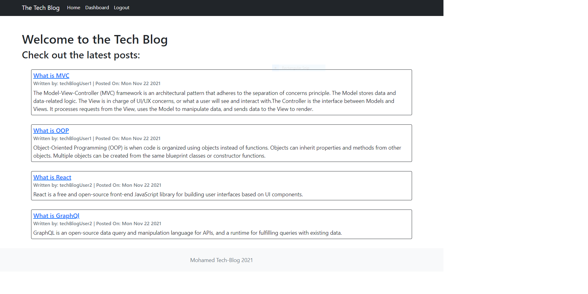

# Tech-Blog
  ## Description
  CMS-style blog site similar to a Wordpress site, where developers can publish their blog posts and comment on other developers’ posts as well.
  https://github.com/ahmedmh9/Tech-Blog
  ## Table of Contents
  * [Installation](#installation)
  * [Usage](#usage)
  * [License](#license)
  * [Tests](#Tests)
  * [Contributions](#Contributions)
  * [Contact](#Contact)
  
  ## Installation 
  Required dependencies to be installed for application functionality: npm i
  ## Usage

  ## Mock
  
  ## License
  
  ## Contributions
  
  ## Tests
  For tests use the following commands: npm test
  
  ## Questions?
  Contact me at:
  GitHub: https://github.com/ahmedmh9
  * E-mail: axmedmohamed7@gmail.com
